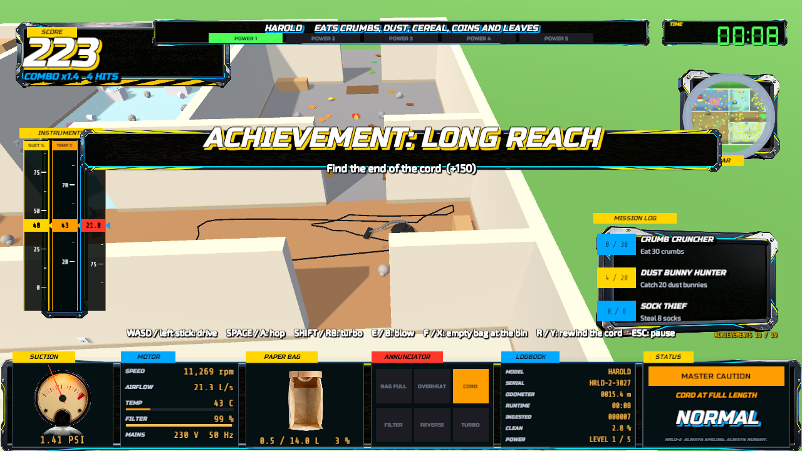
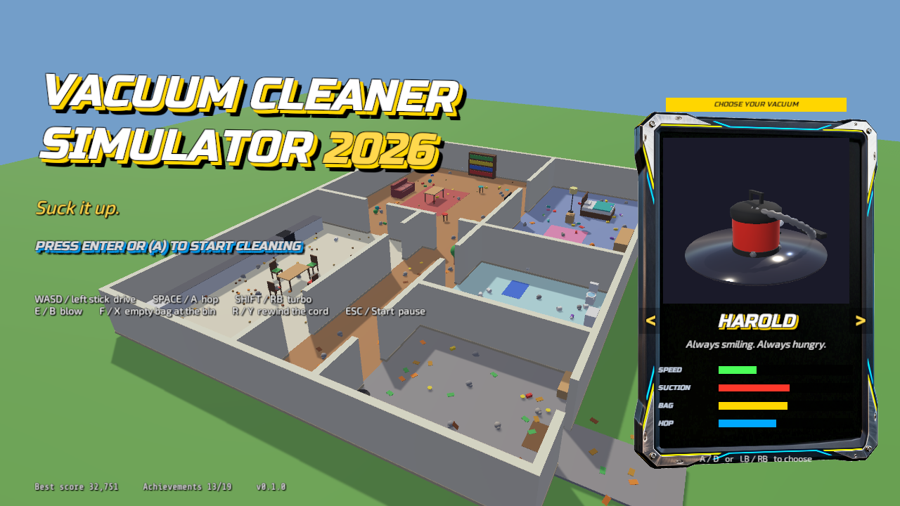
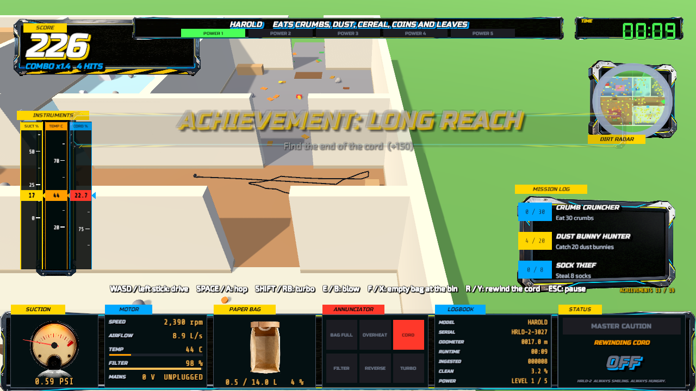

# Vacuum Cleaner Simulator 2026

A silly physics sandbox in the spirit of Goat Simulator, except you are a vacuum cleaner and the house is a mess.
Drive around, suck up crumbs, socks, toys, then chairs, the couch, and eventually the toilet. Blow it all back out.
Rated for ages 8 and up: cartoon chaos, no violence.

**Download:** the latest Windows build is on the
[releases page](https://github.com/vrixel/VacuumCleanerSimulator2026/releases/latest). Unzip, run the exe.





Targets: Steam (Windows 64-bit) first, Xbox / Microsoft Store next. See `docs/PUBLISHING.md` and `docs/STORE.md`.
Source is published for reference; see `LICENSE.md`.

## Play

On the title screen, pick your vacuum with A / D (or LB / RB): seven machines with different speed, suction, bag
size and hop, from a robot disc to a wet/dry drum that eats furniture early.

| Action | Keyboard / mouse | Xbox controller |
|--------|------------------|-----------------|
| Choose vacuum (title) | A / D or arrows | LB / RB or d-pad |
| Drive | WASD | Left stick |
| Look | Mouse | Right stick |
| Hop | Space | A |
| Turbo | Shift | RB or RT |
| Blow (spit the bag out) | E or right mouse | B or LT |
| Empty bag at the bin | F | X |
| Rewind the cord (corded models) | R | Y |
| Pause | Esc | Start |

## Build

Unity 6000.3.23f1 with the Windows (Mono) module, installed under `D:\Program Files\Unity\Hub\Editor`.
Builds happen locally, never in GitHub Actions.

```powershell
powershell -File tools\compile-check.ps1   # compile the scripts against Unity's assemblies, no editor needed
powershell -File tools\build.ps1 -Run      # batch-mode build to Builds\Win64, then launch it
```

## Layout

- `Assets/Scripts` runtime code, everything is generated at runtime from primitives (no art assets yet)
- `Assets/Editor` batch build and project setup
- `docs/DESIGN.md` game design, `docs/PUBLISHING.md` store pipeline
- `tools/` PowerShell helpers
